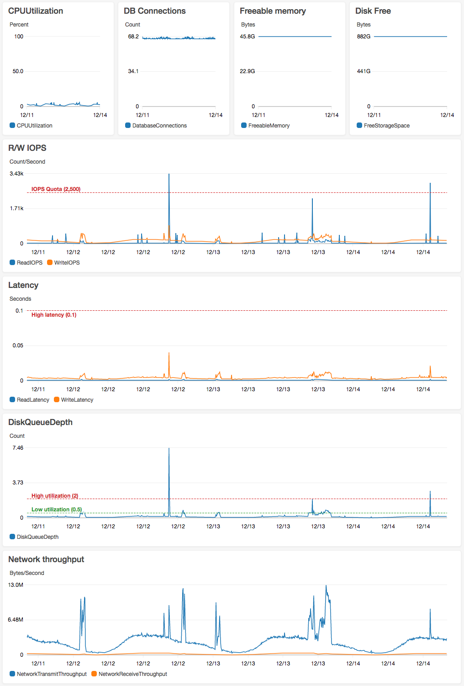

# CloudWatch Dashboard for RDS

This module presents a standard CloudWatch dashboard appropriate for any RDS
instance. The caller specifies the ARN of an RDS instance, and the module takes
care of creating a CloudWatch dashboard showing a variety of useful metrics.

## Usage

### Example

```hcl
module "rds_dashboard_my_database" {
    source = "github.com/18F/identity-terraform//cloudwatch_dashboard_rds?ref=master"

    dashboard_name = "my-rds-dashboard"

    region = "us-east-1"

    db_instance_identifier = "${aws_db_instance.my_rds_instance.id}"
    iops = "${aws_db_instance.my_rds_instance.iops}"

    # optional vertical annotations of important time markers
    vertical_annotations = <<EOM
[
  {
    "color": "#666",
    "label": "Increased PIOPS 1500 => 2500",
    "value": "2018-01-25:05:00.000Z"
  }
]
EOM

}

```

### Screenshot in action


